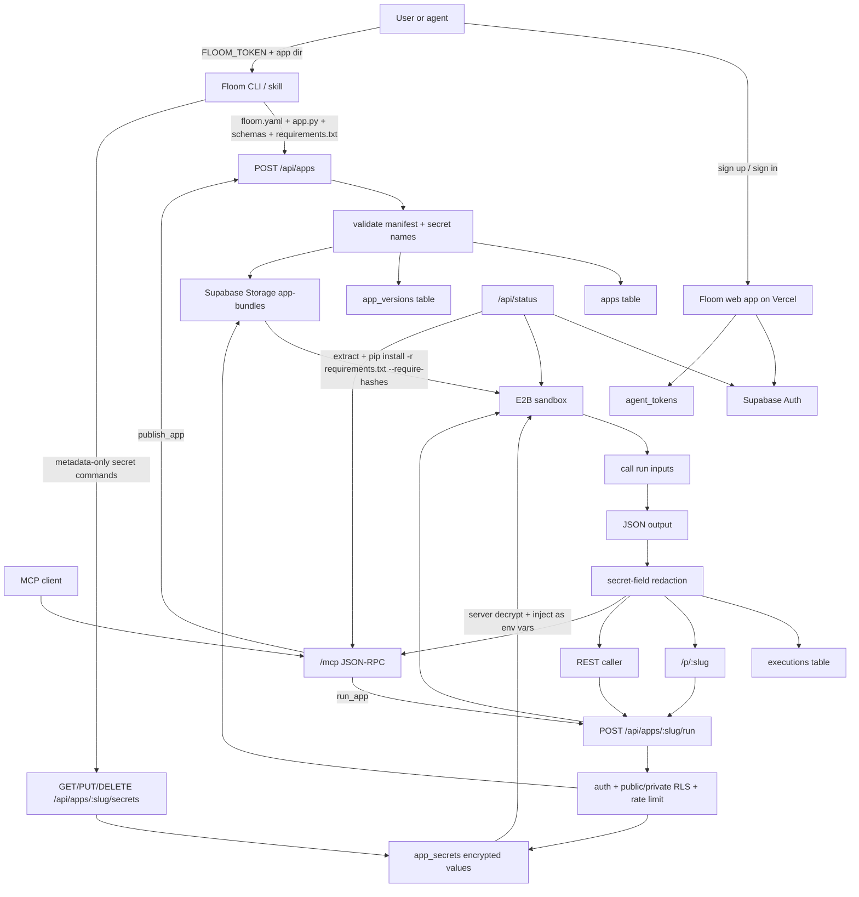

# Floom v0.1 Architecture

Production URL: `https://floom.dev`

Current shipped scope (v0.1): single-file Python function apps with JSON Schema input/output, `requirements.txt` with hash-locked pins, encrypted-at-rest secrets injected as env vars at runtime, published with a Floom agent token.

## v0.1 Contract

Required app files:

- `floom.yaml` (manifest)
- one Python file, usually `app.py` with `def run(inputs: dict) -> dict`
- `input.schema.json`
- `output.schema.json`
- `requirements.txt` (optional, hash-pinned)

v0.1 accepts:

- `runtime: python` (Python 3.11+)
- one handler function per app
- third-party Python packages via exact-pinned, hash-locked `requirements.txt` declared as `dependencies.python: ./requirements.txt`
- `secrets: [NAME, ...]` in `floom.yaml` — names only, never values
- public apps via `public: true`, gated by RLS on `apps.public = true`
- private apps (default) — owner-only via Supabase Auth or matching agent token
- size limits: bundle 10 MB, single file 5 MB, output 1 MB, runtime 60 s, memory 512 MB
- rate limit: 60 s window per caller

v0.1 rejects:

- raw secret values anywhere (manifest, source, logs, MCP output, API responses, app versions, executions, bundle storage, docs)
- FastAPI/OpenAPI servers
- TypeScript/Node apps
- multi-file Python projects (one entrypoint module)
- multiple manifest actions
- streaming responses
- long-running processes

## Secret storage

`FLOOM_SECRET_ENCRYPTION_KEY` is a server-only base64-encoded 32-byte key. App owners manage values via `GET/PUT/DELETE /api/apps/:slug/secrets` or `npx @floomhq/cli@latest secrets`. List responses contain only `name`, `created_at`, and `updated_at` metadata. Values decrypt server-side at run time and are injected as E2B environment variables — never round-tripped to the client.

## v0.1 Launch Blockers

Public self-serve sign-up is gated on fresh provider-email verification:

- The app-side redirect is fixed for `https://floom.dev/auth/callback?next=/tokens`.
- Supabase Auth provider settings and SMTP/rate-limit behavior still need a fresh real-email pass before public self-serve launch.
- Google OAuth must be verified through the full production callback, not only provider handoff.

Verified working:

- Agent token creation in authenticated browser sessions.
- CLI publish with `FLOOM_TOKEN`.
- Public app metadata and run.
- Private anonymous metadata/run blocked at API and RLS layers.
- Private owner token metadata/run.
- Browser, REST, and MCP run surfaces.
- E2B-backed execution with `requirements.txt` install.
- Secret injection into E2B as env vars (no values in source/manifest/logs/output).
- Supabase app/version/execution/storage evidence in virgin QA runs.
- `/api/status` health probe (Supabase + E2B + MCP self-check).
- Middleware HTTP 307 for `/tokens` when no Supabase session cookie.

## Versioning Roadmap (post-launch)

See `docs/runtime-versioning-roadmap-brief.md` for the canonical brief.

Model: one capability per minor version, one branch per capability. Version number is assigned at merge time (first to merge becomes v0.2, next v0.3, and so on). Each branch must ship together: real template using the capability, `get_app_contract` updated, `/docs` section, `CHANGELOG.md` entry.

Capabilities in flight:

- TypeScript / Node runtime
- Multi-action manifests (more than one endpoint per app)
- Streaming responses (SSE)
- FastAPI / OpenAPI app mode
- JavaScript runtime
- Multi-file Python bundles

Constraint: no more than three capability branches in flight at once. Sequencing decided post-launch (`docs/runtime-versioning-roadmap-brief.md`).
