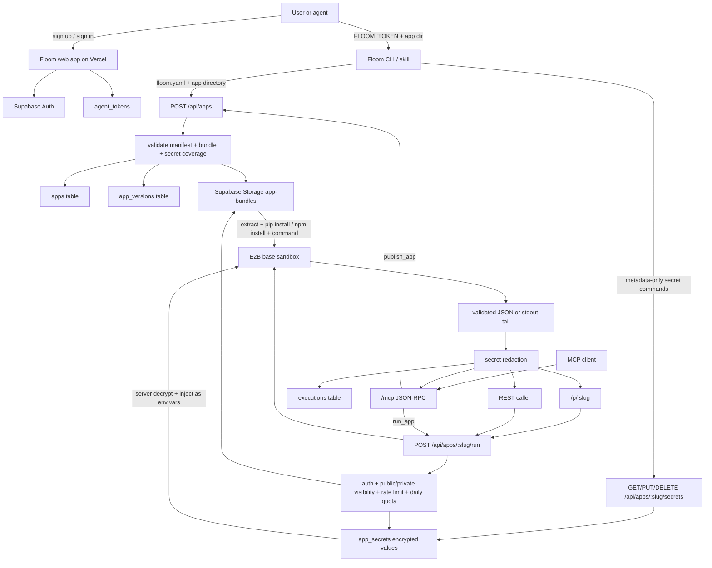

# Floom Architecture

Production URL: `https://floom.dev`

This document now describes two layers:

1. **Preferred post-launch contract:** stock-E2B mode.
2. **Legacy compatibility contract:** the v0.1 single-file Python handler shape, still supported.

Floom is not a parallel runtime. E2B owns runtime depth. Floom owns the wrapper: app URL, form UI, one agent-callable contract, secret brokerage, redaction, quotas, and rate limits.



## Preferred Contract: Stock-E2B

Required at publish:

- `floom.yaml` at the bundle root
- a `.tar.gz` bundle of the app directory

Preferred minimal manifest:

```yaml
slug: my-app
input_schema: ./input.schema.json
output_schema: ./output.schema.json
secrets:
  - GEMINI_API_KEY
public: true
```

Optional manifest fields:

- `command: <shell>` if auto-detection is not enough
- `dependencies.python: ./requirements.txt --require-hashes` for opt-in hash enforcement
- `bundle_exclude: [...]` additive exclusions on top of Floom defaults
- `name`, `description`

Command detection when `command:` is omitted:

- `app.py` exists -> `python app.py`
- `index.js` exists -> `node index.js`
- `package.json` has `scripts.start` -> `npm start`
- multiple matches fail with `ambiguous command auto-detection`
- zero matches fail with `no command detected, please specify command: in floom.yaml`

Run-time behavior:

- extract bundle into `/home/user/app`
- if `requirements.txt` exists, run `pip install -r requirements.txt`
- if `package.json` exists, run `npm install`
- inject declared secrets as environment variables
- inject inputs both as stdin and `FLOOM_INPUTS`
- run the command

Output behavior:

- if `output_schema` exists, read JSON from stdout final line or `/home/user/output.json`, validate it, return parsed JSON
- if `output_schema` is absent and stdout final line is valid JSON, return parsed JSON
- otherwise return `{ stdout, exit_code }` with the last 4 KB of stdout

Bundle validation:

- compressed max: `5 MB`
- unpacked max: `25 MB`
- file count max: `500`
- single file max: `10 MB`
- decompression ratio max: `100x`
- reject path traversal, absolute paths, symlinks, hardlinks, device files, FIFOs

Daily quota model:

- per app: `30` E2B minutes per 24h
- per owner: `2` E2B hours per 24h across all apps
- failures count against quota too

Known limits:

- synchronous only for now
- current cap remains `60s`
- arbitrary HTTP route proxying is still out of scope

## Legacy Compatibility: v0.1

Still accepted:

```yaml
name: Meeting Action Items
slug: meeting-action-items
runtime: python
entrypoint: app.py
handler: run
public: true
input_schema: ./input.schema.json
output_schema: ./output.schema.json
dependencies:
  python: ./requirements.txt
```

Legacy apps remain valid and keep running. New publishes of that shape are wrapped into tarballs and executed through the same stock-E2B path, but the manifest contract remains unchanged for the app author.

Legacy guarantees preserved:

- one Python entrypoint module
- one handler function
- optional secret declarations
- optional `requirements.txt`
- public/private sharing model unchanged

## Design Decision

The rule for keeping a Floom constraint is:

> If E2B would accept it, Floom accepts it unless the constraint is needed for sharing, secrets, rate limiting, redaction, or the one-run agent contract.

That is why this branch removes:

- Python-only runtime gating
- single-file bundle enforcement
- required handler wrapper for new apps
- required schemas for all apps
- hash-pinned requirements as the default

And keeps:

- app URL + run endpoint shape
- secrets as declared names only
- redaction
- public/private access control
- rate limits and quotas
- bundle size and safety checks
