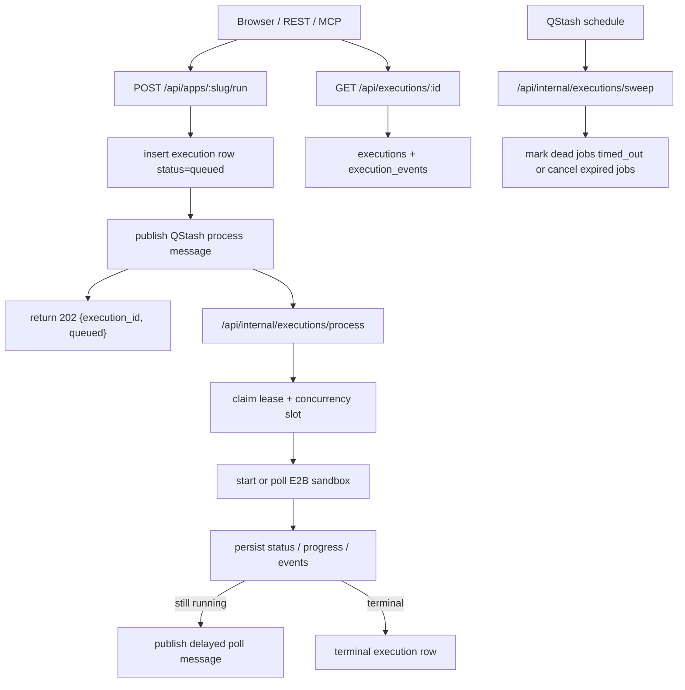
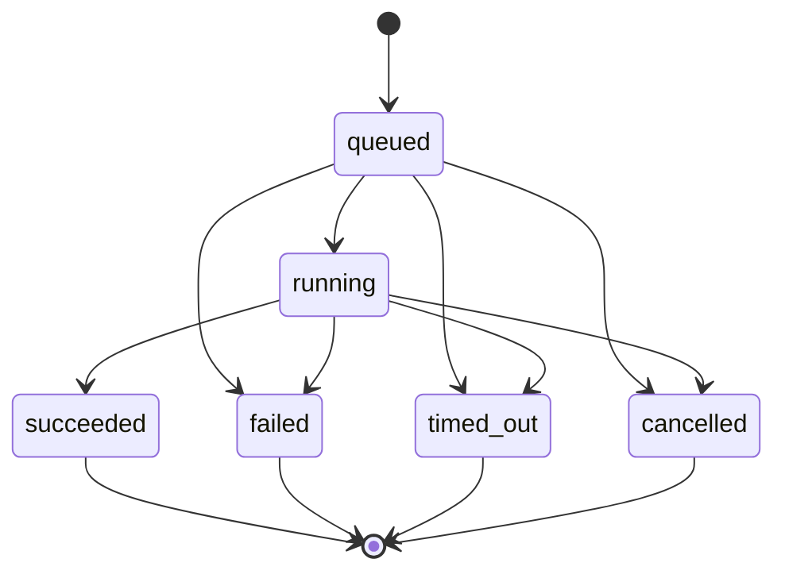

# Floom v0.x Async + Poll Runtime Spec
Branch: `feat/v0.x-async-poll-runtime`
Status: `spec`
Updated: `2026-05-01`
## 0. Scope Context
This document is the implementation spec for the async + poll runtime capability requested for branch `feat/v0.x-async-poll-runtime`.
It follows the per-capability spec format required by [docs/runtime-versioning-roadmap-brief.md](./runtime-versioning-roadmap-brief.md).
The checked-in roadmap brief currently enumerates capabilities `A` through `F`; this file is the missing spec stub for the async capability requested alongside that brief.
This branch is intentionally narrower than full streaming capability `C`.
In scope:
- async execution dispatch
- execution status polling
- optional status/progress SSE
- cancellation
- dead-job recovery
- MCP parity for async execution handles
Out of scope:
- token streaming
- chunked output streaming
- multi-action manifests
- Node or JS runtime support
- multi-file packaging
- FastAPI or OpenAPI hosting
## 1. Problem Statement
Floom v0.1 blocks `POST /api/apps/<slug>/run` until the E2B sandbox finishes. That fails for any real work near or past Vercel Hobby's 60 second function cap.
Pro would only move the cap to about 300 seconds. The product goal here is hours, not minutes.
Three verified constraints in the current repo drive this spec:
1. `src/app/api/apps/[slug]/run/route.ts` is fully synchronous today.
2. `src/lib/e2b/runner.ts` exposes only blocking helpers.
3. `/p/<slug>` and MCP `run_app` both assume one-request terminal execution.
The implementation therefore needs a re-entrant runtime. Any design that still waits for the full sandbox lifetime inside one Vercel request does not satisfy this spec.
## 2. Decision Summary
This section is normative. If any later section conflicts with it, this section wins.

### 2.1 Contract
- `POST /api/apps/<slug>/run` becomes async by default.
- Default success response is `202 Accepted` with `{ execution_id, status: "queued" }`.
- Request body stays `{ inputs: { ... } }`.
- Validation, auth, rate-limit, and app lookup error bodies stay unchanged.
- `?wait=true` provides best-effort synchronous waiting for short apps.
- `GET /api/executions/<id>` is the canonical execution status endpoint.
- `DELETE /api/executions/<id>` is the canonical cancellation endpoint.
- `GET /api/executions/<id>` supports JSON and SSE when `Accept: text/event-stream`.

### 2.2 Status Vocabulary
The only valid post-branch execution statuses are:
- `queued`
- `running`
- `succeeded`
- `failed`
- `timed_out`
- `cancelled`

Legacy `success` and `error` are migration-only aliases. New routes and tools must not emit them once the async flag is enabled.

### 2.3 Queue Substrate
Choose `QStash` from Upstash. It is the lowest-cost option that supports delayed wake-ups, scheduled sweeps, message deduplication, and short worker invocations without requiring a Vercel plan upgrade.

### 2.4 Runtime Shape
The worker model is re-entrant, not long-lived. Each invocation does one short unit of work: claim, start, poll, persist, requeue, or finalize.
`src/lib/e2b/runner.ts` remains the runtime entry module but grows start/poll/kill primitives around the existing wrapper.

### 2.5 Persistence Shape
`executions` remains the source of truth for final state. Add lifecycle columns there and add an append-only `execution_events` table for partial progress and logs.
Final output stays in `executions.output`. Partial output does not.

### 2.6 UI And Concurrency
`/p/<slug>` submits once, receives an `execution_id`, then polls `GET /api/executions/<id>` every `1s` for `30s` and slows down after that if the run is still active.
Per-app concurrency is a soft cap of `10` running executions per app. Additional runs stay queued unless queue depth protection fires.

### 2.7 Retry And Rollout
Runtime retries are off by default. A single delayed retry is allowed only for explicitly classified transient infrastructure failures and only when enabled by config.
Everything is gated behind `FLOOM_ASYNC_RUNTIME=enabled`. Flag-off behavior stays v0.1 synchronous.

## 3. Current State
The repo today shows these verified facts:

- `src/app/api/apps/[slug]/run/route.ts` validates inputs, writes an execution row as `running`, downloads the bundle, resolves secrets, calls `runInSandboxContained`, validates output, updates the row, and returns the terminal envelope directly.
- `src/lib/e2b/runner.ts` calls E2B synchronously and kills the sandbox in `finally`.
- `src/lib/mcp/tools.ts` describes `run_app` as returning `{ execution_id, status, output, error }` in one call.
- `src/components/runner/RunSurface.tsx` assumes the POST response already includes `output`.
- `PastRunsDisclosure` exists as a stub and explicitly names `/api/apps/<slug>/runs` as its intended backing surface.
- the current migration constrains execution status to `running`, `success`, and `error`
- current execution reads are enforced in the API layer because the service-role admin client bypasses RLS

## 4. Architecture Overview
The async runtime is database-driven. Queue messages are hints to continue work, not the source of truth.



Design rules:
1. Insert the execution row before background work starts.
2. Persist every status change before returning from the worker.
3. Re-read DB state on every worker entry; never trust message body as authority.
4. Keep all worker invocations comfortably below the Vercel request cap.
5. Treat terminal rows as immutable.

## 5. Public API Contract
This section is normative.

### 5.1 `POST /api/apps/<slug>/run`
Method: `POST`
URL: `/api/apps/<slug>/run`
Query params:

| Name | Type | Required | Default | Meaning |
| --- | --- | --- | --- | --- |
| `wait` | `true \| false` | no | `false` | Best-effort synchronous wait for short runs. |

Request body stays unchanged:

```json
{
  "inputs": {
    "...": "..."
  }
}
```

The route still rejects:
- missing `inputs`
- non-object `inputs`
- oversized `inputs`
- invalid JSON
- input-schema mismatch

Auth and access rules stay unchanged from v0.1:
- public app: anonymous allowed
- private app: owner session or owner agent token required
- invalid bearer token: `401`
- private app without auth: `404 App not found` to avoid slug enumeration
- private app with wrong owner token: `404 App not found` to avoid slug enumeration
- agent tokens still need `run` scope

Default async success response:

```json
{
  "execution_id": "uuid",
  "status": "queued"
}
```

Rules for the default async path:
- HTTP status is `202 Accepted`
- the route must return in under `500ms` for the required 90-second fixture
- return `queued` only after insert and queue publish both succeed
- if insert succeeds but queue publish fails, either delete the row or mark it terminal before returning `500`; do not leave an unreachable queued row behind

Error responses are unchanged only for failures that happen before queue handoff:
- bad JSON
- missing inputs
- validation failure
- request too large
- unauthorized token
- forbidden private run
- app not found
- rate limit exceeded
- failed execution insert
- failed queue publish

Runtime failures that happen after queue handoff no longer come back from the initial POST in default async mode. They surface through `GET /api/executions/<id>`.

### 5.2 `?wait=true`
`?wait=true` preserves blocking semantics for short runs but not at the cost of Vercel timeouts.
Behavior:
1. validate and enqueue exactly like the async default path
2. locally poll the execution row for up to `SYNC_WAIT_BUDGET_MS`
3. if the execution reaches terminal state within budget, return the terminal envelope
4. if budget expires first, return the current snapshot with HTTP `202`

`SYNC_WAIT_BUDGET_MS` is:
- `55_000` on Hobby
- `295_000` on Pro
- `min(plan budget, SANDBOX_TIMEOUT_MS)`

Terminal wait=true response shape:

```json
{
  "execution_id": "uuid",
  "status": "succeeded",
  "output": {},
  "error": null,
  "started_at": "2026-05-01T12:00:00.000Z",
  "completed_at": "2026-05-01T12:00:04.200Z",
  "progress": null
}
```

Non-terminal timeout of the wait budget returns HTTP `202` with:

```json
{
  "execution_id": "uuid",
  "status": "running",
  "output": null,
  "error": null,
  "started_at": "2026-05-01T12:00:00.000Z",
  "completed_at": null,
  "progress": {
    "kind": "percent",
    "percent": 35,
    "label": "Installing dependencies"
  }
}
```

This keeps short apps synchronous while keeping long apps from turning back into function timeouts.

### 5.3 `GET /api/executions/<id>`
Method: `GET`
URL: `/api/executions/<id>`

Default JSON response:

```json
{
  "execution_id": "uuid",
  "status": "running",
  "output": null,
  "error": null,
  "started_at": "2026-05-01T12:00:00.000Z",
  "completed_at": null,
  "progress": {
    "kind": "stages",
    "current": 2,
    "total": 4,
    "label": "Installing dependencies",
    "stages": [
      { "key": "queued", "label": "Queued", "status": "done" },
      { "key": "boot", "label": "Boot sandbox", "status": "done" },
      { "key": "deps", "label": "Install dependencies", "status": "running" },
      { "key": "run", "label": "Run handler", "status": "pending" }
    ]
  }
}
```

Field rules:
- `execution_id`: execution UUID
- `status`: one of the six canonical statuses
- `output`: `null` until `succeeded`; final redacted JSON object on success
- `error`: `null` until terminal failure; sanitized string for `failed`, `timed_out`, or `cancelled`
- `started_at`: `null` while still queued
- `completed_at`: `null` until terminal
- `progress`: omitted or `null` if no runtime progress exists

Auth follows the underlying app, not the original caller identity:

| App visibility | Anonymous read | Owner session | Owner agent token with `read` | Owner agent token with `run` only | Non-owner token |
| --- | --- | --- | --- | --- | --- |
| Public | allowed | allowed | allowed | allowed | allowed |
| Private | denied | allowed | allowed | allowed | denied |

For private executions:
- invalid bearer token returns `401`
- missing auth returns `404`
- valid non-owner auth returns `404`

The route must use the same `404` body for missing and unauthorized private execution lookups to avoid turning execution IDs into an existence oracle.

### 5.4 `GET /api/executions/<id>` with SSE
If the request sends `Accept: text/event-stream`, return an SSE stream instead of JSON.
Event types for this branch are:
- `snapshot`
- `status`
- `progress`
- `completed`
- `keepalive`

Example:

```text
retry: 1000
event: snapshot
id: 41
data: {"execution_id":"uuid","status":"running","progress":{"kind":"percent","percent":10}}

event: progress
id: 42
data: {"execution_id":"uuid","status":"running","progress":{"kind":"percent","percent":35}}

event: completed
id: 43
data: {"execution_id":"uuid","status":"succeeded","output":{"result":"ok"},"completed_at":"2026-05-01T12:01:30.000Z"}
```

This SSE path is status-only. It does not stream stdout or arbitrary output chunks.

Because the project runs on Vercel serverless functions, the route must not attempt one indefinite connection. Server behavior:
- keep one SSE response open for at most `25s`
- emit `snapshot` immediately
- emit later `status` or `progress` events from `execution_events`
- emit a keepalive comment at least every `10s`
- close after `25s` if the execution is still non-terminal

Client behavior:
- auto-reconnect
- pass `Last-Event-ID` when present
- stop reconnecting on a terminal event

The result is a logically continuous stream without relying on a single long-lived request.

### 5.5 `DELETE /api/executions/<id>`
Method: `DELETE`
URL: `/api/executions/<id>`

This endpoint is required for caller-initiated cancellation.

Auth:
- private executions: owner session or owner agent token only
- public execution reads are anonymous, but public execution cancellation is owner-only in v0.x to avoid ambiguous anonymous-caller authorization
- invalid bearer token returns `401`
- missing or unauthorized private access returns `404`

Response when status is `queued`:

```json
{
  "execution_id": "uuid",
  "status": "cancelled",
  "completed_at": "2026-05-01T12:00:05.000Z"
}
```

Response when status is `running`:

```json
{
  "execution_id": "uuid",
  "status": "running",
  "cancel_requested": true
}
```

and uses HTTP `202 Accepted`.

If the execution is already terminal, return `200` with the current snapshot and do nothing else.

## 6. Status Model
Canonical states:

| Status | Terminal | Meaning |
| --- | --- | --- |
| `queued` | no | Accepted and waiting for a worker slot. |
| `running` | no | Sandbox lifecycle has started. |
| `succeeded` | yes | Handler completed, output validated, output persisted. |
| `failed` | yes | Non-timeout, non-cancel runtime/setup/validation failure. |
| `timed_out` | yes | Exceeded `SANDBOX_TIMEOUT_MS` or dead-job recovery deadline. |
| `cancelled` | yes | Caller or TTL cancellation completed. |

Allowed transitions:
- `queued -> running`
- `queued -> cancelled`
- `queued -> failed`
- `queued -> timed_out`
- `running -> succeeded`
- `running -> failed`
- `running -> timed_out`
- `running -> cancelled`

Disallowed transitions:
- terminal -> anything else
- `running -> queued`
- `succeeded -> failed`
- `cancelled -> failed`



Semantic definitions:
- `failed` covers bundle download failure, secret resolution failure, missing required secret, E2B API failure not classified as transient infra failure, output missing, output malformed, or output schema validation failure
- `timed_out` covers command runtime beyond `SANDBOX_TIMEOUT_MS`, stale dead-job recovery timeout, or queued execution that never starts before `QUEUE_TTL_MS`
- `cancelled` covers explicit `DELETE`, TTL cancellation, or future owner/admin cancellation surfaces

Migration rules for legacy rows:
- `success -> succeeded`
- `error -> failed`
- `running` older than `SANDBOX_TIMEOUT_MS * 2` at migration time -> `timed_out`
- newer `running` rows may remain `running`

## 7. Queue Substrate Decision
Candidates scored:
1. Inngest
2. QStash (Upstash)
3. Vercel cron + DB-backed queue

Scoring dimensions:
- latency to start or continue work
- monthly cost at `1k runs/day`
- ops surface
- vendor lock-in
- ability to satisfy the requirement on Hobby with hours-scale runs

Assumptions for rough monthly cost:
- `1k runs/day`
- `30k runs/month`
- baseline of `10` queue/workflow steps per run for comparison, which is conservative for a 90-second fixture with delayed polling

Score table:

| Candidate | Latency | Cost @ 1k/day | Ops surface | Lock-in | Hobby viability | Total / 25 |
| --- | ---: | ---: | ---: | ---: | ---: | ---: |
| Inngest | 4 | 2 | 3 | 2 | 4 | 15 |
| QStash | 4 | 5 | 4 | 3 | 5 | 21 |
| Vercel cron + DB queue | 1 | 2 | 2 | 4 | 1 | 10 |

Why Inngest loses:
- durable execution is strong, but the integration is more invasive than this branch needs
- default retries are on unless explicitly set to `0`
- step-based billing scales with every poll or wake-up
- at `30k runs/month`, even a modest multi-step flow quickly exceeds the free tier and effectively pushes the branch into a `$75/month` plan

Why Vercel cron loses:
- Hobby cron runs only once per day and is imprecise
- Pro cron is still minute-level and too coarse for responsive interactive status
- the team would still have to build queueing, dedupe, scheduling, and recovery from scratch
- the worker remains bound to Vercel function limits

Why QStash wins:
- delayed wake-ups, schedules, dedupe, and signatures exist already
- the worker can stay short and stateless
- the DB remains the durable authority, so lock-in is moderate rather than deep
- baseline queue cost is low single-digit USD per month at the required workload

This closes the queue-substrate open question. Choose `QStash`.

## 8. Data Model And Migrations
Keep `executions` as the durable row for each run. Do not replace it with a queue-owned table.

Add these columns to `public.executions`:

| Column | Type | Null | Purpose |
| --- | --- | --- | --- |
| `started_at` | `timestamptz` | yes | When worker first starts sandbox lifecycle. |
| `progress` | `jsonb` | yes | Latest sanitized progress snapshot for fast reads. |
| `last_heartbeat_at` | `timestamptz` | yes | Last worker heartbeat. |
| `lease_token` | `uuid` | yes | Current worker lease owner token. |
| `lease_expires_at` | `timestamptz` | yes | Lease expiry for dead-job detection. |
| `cancel_requested_at` | `timestamptz` | yes | Caller cancel intent time. |
| `cancel_reason` | `text` | yes | `caller`, `ttl`, or `admin`. |
| `timed_out_at` | `timestamptz` | yes | Exact timeout mark time when distinct from `completed_at`. |
| `sandbox_id` | `text` | yes | E2B sandbox identifier. |
| `sandbox_pid` | `integer` | yes | Background command PID inside the sandbox. |
| `poll_count` | `integer default 0` | no | Number of worker poll passes. |
| `infra_attempt_count` | `integer default 0` | no | Number of controlled infra retries. |
| `next_poll_at` | `timestamptz` | yes | Last scheduled poll time for observability and sweeps. |

Create append-only `public.execution_events`:

| Column | Type | Null | Purpose |
| --- | --- | --- | --- |
| `id` | `bigint generated always as identity` | no | Monotonic event id for SSE resume. |
| `execution_id` | `uuid references executions(id) on delete cascade` | no | Parent execution. |
| `kind` | `text` | no | Event type. |
| `payload` | `jsonb` | yes | Sanitized event payload. |
| `created_at` | `timestamptz default now()` | no | Event timestamp. |

Allowed `kind` values for v0.x:
- `status`
- `progress`
- `stdout`
- `stderr`
- `heartbeat`
- `system`

Why a separate event table is correct:
1. it avoids rewriting the whole execution row for every progress tick
2. it gives SSE a natural cursor via the event id
3. it prevents `executions.output` from mixing terminal and partial state
4. it becomes the basis for later streaming work without forcing it into this branch

Status constraint migration order:
1. add new columns
2. backfill legacy statuses
3. drop the old status constraint
4. add the new six-value status constraint
5. create indexes
6. deploy code that emits only new statuses

Indexes:
- `(status, created_at desc)` for sweeps
- `(app_id, status, created_at desc)` for history and concurrency checks
- partial `(lease_expires_at)` where status in (`queued`,`running`)
- `(execution_id, id)` on `execution_events`

RLS note:
Do not rely on DB RLS alone for public execution reads in this branch. The API route uses the admin client and must enforce visibility directly.

## 9. Runtime Contract Inside The Sandbox
The re-entrant worker needs stable on-disk artifacts inside the sandbox.

Required files in the working directory:
- `inputs.json`
- `runner.py`
- `stdout.log`
- `stderr.log`
- `progress.json` optional
- `result.json` terminal wrapper artifact
- `output.json` optional intermediate artifact if the wrapper still writes it separately

`result.json` is the worker-facing canonical terminal artifact:

```json
{
  "ok": true,
  "output": { "...": "..." },
  "error": null
}
```

or:

```json
{
  "ok": false,
  "output": null,
  "error": "App execution failed"
}
```

Progress contract:
- expose `FLOOM_PROGRESS_PATH=/home/user/progress.json`
- apps may ignore it
- if they write progress, it must be valid JSON in one of two shapes

Percent shape:

```json
{
  "kind": "percent",
  "percent": 42,
  "label": "Parsing transcript",
  "detail": "3 of 7 chunks"
}
```

Stages shape:

```json
{
  "kind": "stages",
  "current": 2,
  "total": 4,
  "label": "Installing dependencies",
  "stages": [
    { "key": "fetch", "label": "Fetch", "status": "done" },
    { "key": "parse", "label": "Parse", "status": "running" },
    { "key": "score", "label": "Score", "status": "pending" },
    { "key": "render", "label": "Render", "status": "pending" }
  ]
}
```

Rules:
- invalid progress file does not fail the execution
- invalid progress file is ignored
- append one `system` event the first time parsing fails
- clamp `percent` to `0..100`
- run progress through the same secret redaction path used for output

Stdout and stderr handling:
- launch the wrapper with file redirection
- on each poll, read only the new byte range not yet persisted
- append sanitized chunks to `execution_events`
- do not expose those chunks publicly in this branch

## 10. Worker And Queue Architecture
Add two internal routes:
- `POST /api/internal/executions/process`
- `POST /api/internal/executions/sweep`

These are QStash-only callback surfaces. They are not public API.

Authentication:
- verify QStash signatures on every request
- do not trust source IP or path obscurity
- required env vars: `QSTASH_TOKEN`, `QSTASH_CURRENT_SIGNING_KEY`, `QSTASH_NEXT_SIGNING_KEY`

Process-message body:

```json
{
  "execution_id": "uuid",
  "phase": "process",
  "scheduled_at": "2026-05-01T12:00:00.000Z"
}
```

Sweep-message body:

```json
{
  "kind": "sweep"
}
```

QStash publish rules for worker wake-ups:
- `Upstash-Retries: 0`
- `Upstash-Deduplication-Id: execution:<id>:poll:<n>`
- use `Upstash-Delay` for future wake-ups

Sweep schedule:
- one QStash schedule
- cron `* * * * *`
- destination `/api/internal/executions/sweep`
- retries `0`

Why queue-level retries are disabled:
1. duplicate delivery belongs under the DB lease model, not hidden inside the queue
2. infra retries need classification, not blanket replay
3. application failures must not be retried implicitly

Lease model:
- lease duration `90s` by default via `FLOOM_EXECUTION_LEASE_MS=90000`; this is longer than one sandbox poll cycle and shorter than the default stale-running recovery window
- claim with `select ... for update`
- if terminal, no-op
- if an unexpired lease belongs to another worker, no-op and return `202`
- otherwise set a new `lease_token`, `lease_expires_at`, and `last_heartbeat_at`
- refresh the lease every time the worker persists progress or status

## 11. E2B Runner Changes
Current `runInSandboxContained` is blocking and therefore cannot power this branch on Vercel.
`src/lib/e2b/runner.ts` must gain new async-safe primitives. The exact function names can vary, but the behavior cannot.

Required capabilities:
- start a sandbox execution in the background and return `{ sandboxId, pid }`
- reconnect to an existing sandbox and process
- read incremental stdout/stderr and current progress
- detect terminal completion by reading `result.json`
- kill the running command and sandbox
- keep `runInSandboxContained` as the compatibility wrapper for flag-off mode and remaining synchronous call sites

Start behavior:
1. create sandbox
2. write source and dependency files
3. install dependencies if present
4. write `runner.py` and `inputs.json`
5. launch the handler wrapper in background mode
6. persist sandbox id and pid
7. return without waiting for full completion

Poll behavior:
1. reconnect to sandbox by `sandbox_id`
2. reconnect to command by `sandbox_pid` when possible
3. read new stdout/stderr bytes
4. read and sanitize `progress.json` if present
5. detect `result.json`
6. if `result.json` exists, parse it and return terminal data
7. if the process is gone and no result file exists, return `failed`
8. if elapsed time exceeds `SANDBOX_TIMEOUT_MS`, kill and return `timed_out`
9. otherwise return `running`

Kill behavior:
1. reconnect if the sandbox still exists
2. attempt command kill by pid
3. attempt sandbox kill as fallback
4. never surface raw provider errors directly to the caller

## 12. Detailed Execution Lifecycle
### 12.1 Enqueue
`POST /run` does the following:
1. validate request and auth exactly like today
2. insert an execution row with `status = queued`, redacted input, `started_at = null`, `completed_at = null`
3. append `execution_events.kind = status` with `queued`
4. publish one QStash process message
5. return `202`

### 12.2 Claim And Concurrency Gate
On worker wake-up:
1. claim lease
2. fetch the underlying app and latest version
3. if terminal, return
4. if `cancel_requested_at` is already set while still queued, finalize `cancelled`
5. count running executions for the app
6. if running count is `>= FLOOM_APP_CONCURRENCY_SOFT_LIMIT`, reschedule and return
7. otherwise continue

The default soft limit is `10` running executions per app. This closes the concurrency open question.

### 12.3 First Start Pass
If the execution has no `sandbox_id`:
1. download the bundle
2. resolve secrets
3. fail immediately if bundle download or secret resolution fails
4. call the new background-start runner helper
5. update the row to `running`, set `started_at`, `last_heartbeat_at`, `sandbox_id`, `sandbox_pid`, and initial `progress`
6. append a `status` event `running`
7. schedule the next poll

### 12.4 Poll Pass
If the execution already has `sandbox_id`:
1. refresh lease and heartbeat
2. call the poll helper
3. append any new stdout/stderr chunks
4. update `progress` if changed
5. if still running, increment `poll_count`, set `next_poll_at`, publish the next delayed message, and return
6. if terminal, validate output if success path, redact output, persist final status, append final status event, clear lease fields, and kill the sandbox if still alive

### 12.5 Poll Cadence
Default worker cadence:
- first 30 seconds: every `3s`
- 30 seconds to 5 minutes: every `5s`
- 5 minutes to 30 minutes: every `15s`
- over 30 minutes: every `30s`

The browser still polls the public API every `1s` initially. The worker does not need to poll the sandbox every `1s`.

### 12.6 Success
On success:
- validate output against `output_schema`
- if valid, write `status = succeeded`
- if invalid, write `status = failed` with error `Output validation failed`
- write `completed_at = now()`
- store final redacted output in `executions.output`
- optionally keep final progress snapshot in `executions.progress`

### 12.7 Failure
On failure:
- `status = failed`
- `error` is a sanitized string
- `completed_at = now()`
- `output = null`
- clear lease and next-poll metadata

### 12.8 Timeout Enforcement
`SANDBOX_TIMEOUT_MS` is the hard execution budget. Enforce it in two places:
1. E2B sandbox timeout and command kill behavior
2. worker-side elapsed time check using `started_at`

If `now() - started_at >= SANDBOX_TIMEOUT_MS`:
- kill command
- kill sandbox
- persist `timed_out`
- set `timed_out_at` and `completed_at`
- keep any partial logs already written

### 12.9 Caller Cancellation
If `DELETE /api/executions/<id>` sets `cancel_requested_at` while the status is `running`:
1. update the row and append a `system` event `cancel_requested`
2. enqueue an immediate worker wake-up
3. the next worker pass kills the command and sandbox
4. the worker persists `cancelled`

If the execution is still `queued`, cancellation is immediate and no sandbox starts.

### 12.10 TTL Cancellation
Use:
- `QUEUE_TTL_MS = 15 minutes`
- `EXECUTION_TTL_MS = SANDBOX_TIMEOUT_MS + 10 minutes`

Behavior:
- queued longer than `QUEUE_TTL_MS` without starting -> `timed_out`
- running longer than `EXECUTION_TTL_MS` -> `cancelled` with `cancel_reason = ttl`

This splits scheduling failure from hard forced cleanup.

### 12.11 Retry Policy
Default policy is no automatic retry:
- QStash retries: off
- app failures: no retry
- validation failures: no retry
- missing secrets: no retry

Optional infra retry:
- max `1`
- delay `15s`
- only for explicitly classified transient provider failures such as E2B `5xx` or Supabase `5xx`
- guarded by config

Classification rules:
- `4xx` auth and validation failures are permanent
- output validation failure is permanent
- missing secret is permanent

### 12.12 Idempotency
Idempotency rules:
1. execution primary key is the durable identity
2. queue messages are deduped by `Upstash-Deduplication-Id`
3. the lease prevents concurrent processing of the same execution
4. terminal rows are immutable
5. repeated messages for a terminal execution are safe no-ops

## 13. Dead-Job Recovery
Workers can die after claiming a lease or starting a sandbox. Without a sweeper, those runs stick forever.

Use one QStash schedule:
- cron `* * * * *`
- destination `/api/internal/executions/sweep`

The sweeper performs three passes:
1. stale queued: `status = queued` and `created_at < now() - QUEUE_TTL_MS`
2. stale leased: `status in ('queued','running')` and `lease_expires_at < now()`
3. stale running: `status = running` and `last_heartbeat_at < now() - STALE_RUNNING_THRESHOLD_MS`

Recommended `STALE_RUNNING_THRESHOLD_MS = max(2 * current poll delay, 90_000)`.

Sweep actions:
- stale queued with no sandbox id -> mark `timed_out`
- stale running with a sandbox id -> reconnect; if `result.json` exists finalize normally, else kill sandbox and mark `timed_out`
- stale lease with a still-fresh heartbeat but no active worker -> clear lease and republish once

This branch must include the required integration test that simulates worker crash and verifies the heartbeat-based transition to `timed_out`.

## 14. `/p/<slug>` UI Changes
After `POST /run` returns, the page must store the `execution_id`, update local state, and begin polling `GET /api/executions/<id>`.

Default polling cadence:
- every `1s` for the first `30s`
- every `3s` after that until terminal or page unload

This satisfies the task requirement of `1s with 30s max` while still allowing long runs to finish in the UI.

Required visible states:
- `queued`
- `running`
- `succeeded`
- `failed`
- `timed_out`
- `cancelled`

Status pill colors:
- `queued` neutral
- `running` amber
- `succeeded` green
- `failed` red
- `timed_out` red
- `cancelled` gray

Elapsed timer:
- while queued, count from `created_at`
- once running, count from `started_at`
- stop on terminal

Progress rendering:
- if `progress.kind = percent`, show label, numeric percent, and progress bar
- if `progress.kind = stages`, show label and a compact stage list
- if there is no progress, show only status pill and elapsed timer

Output panel behavior:
- while queued or running, keep the output pane visible and non-blocking
- on success, render final output exactly as today
- on failure, show the sanitized error and keep `Try again`

Cancellation UI:
- show `Cancel run` only for `queued` or `running`
- call `DELETE /api/executions/<id>`
- after acceptance, disable the button and keep polling until `cancelled`

SSE alternative:
- may be used when `EventSource` is available
- must fall back to polling
- is optional in this branch; polling is the required baseline

History:
The existing `Past runs` tab must show async runs. If `/api/apps/<slug>/runs` does not yet exist, this branch must add the narrow route needed by the tab.

Minimum history fields:
- `id`
- `status`
- `created_at`
- `started_at`
- `completed_at`
- `error`

Sort by `created_at desc`. Include queued and running rows immediately after enqueue. Clicking a row should deep-link via `?run=<execution_id>` and resume live polling if still active.

## 15. MCP Impact
`run_app` keeps its current name and role.

New input shape:

```json
{
  "type": "object",
  "properties": {
    "slug": { "type": "string" },
    "inputs": { "type": "object", "additionalProperties": true },
    "async": {
      "type": "boolean",
      "description": "If true, return immediately with execution_id instead of waiting for the terminal result."
    }
  },
  "required": ["slug", "inputs"],
  "additionalProperties": false
}
```

Behavior:
- `async` omitted or `false`: keep current blocking MCP behavior for compatibility
- `async = true`: return `{ execution_id, status: "queued" }`

Implementation mapping:
- sync MCP call can hit `POST /run?wait=true`
- async MCP call can hit default `POST /run`

Choose `get_execution` as the new tool. Do not add `wait_for_execution` in the first branch.

`get_execution` input schema:

```json
{
  "type": "object",
  "properties": {
    "execution_id": {
      "type": "string",
      "description": "The execution UUID returned by run_app or POST /api/apps/<slug>/run."
    }
  },
  "required": ["execution_id"],
  "additionalProperties": false
}
```

`get_execution` returns the same JSON shape as `GET /api/executions/<id>`.

`get_app_contract` must be updated to say:
- `POST /run` is async by default
- `?wait=true` exists
- `run_app` supports `async`
- `get_execution` exists
- status vocabulary is the new six-state model
- async is caller-side, not manifest-required

## 16. Manifest Schema
Async is caller-side, not app-side. The app author does not opt the app into an async-only runtime.

Why caller-side wins:
1. the same app may be fast for some inputs and long for others
2. browser and automation clients need different defaults
3. async is a transport concern, not a packaging concern

Allow the optional manifest hint:

```yaml
defaults:
  wait: false
```

Rules for the hint:
- advisory only
- explicit caller choice always wins
- REST default remains async regardless
- MCP and CLI may use the hint to default to async for that app
- the server never rejects a run because the hint disagrees with the caller

Validation:
- `defaults` optional object
- `wait` optional boolean
- no migration required for existing apps

## 17. Auth And Visibility Details
The task requires public app -> public execution. That means `GET /api/executions/<id>` must allow anonymous reads when the underlying app is public.

Private execution reads allow:
- owner browser session
- owner agent token with `read`
- owner agent token with `run`

Why underlying app visibility is the main rule:
1. app owners need to inspect all runs for their app
2. anonymous public runs have no durable authenticated caller identity
3. agent-token runs are owner-scoped already

The app history route should follow the same visibility rule:
- public app history: public
- private app history: owner only

If product policy later narrows public history, `GET /api/executions/<id>` can stay public for public apps without changing this branch's storage model.

## 18. Error Taxonomy
Public terminal error strings must be sanitized and stable. Recommended messages:
- `App execution failed`
- `Failed to download app bundle`
- `Missing configured app secret(s): NAME`
- `Output validation failed`
- `Execution exceeded SANDBOX_TIMEOUT_MS`
- `Execution was cancelled`

Record machine-oriented internal codes in `execution_events.kind = system`, for example:
- `bundle_download_failed`
- `secret_resolution_failed`
- `missing_secret`
- `sandbox_start_failed`
- `sandbox_poll_failed`
- `sandbox_command_missing`
- `output_missing`
- `output_invalid_json`
- `output_validation_failed`
- `timeout`
- `cancel_requested`
- `cancel_completed`
- `lease_conflict`

These codes are for operators and future tooling, not the public route in v0.x.

## 19. Environment Variables
Required:
- `FLOOM_ASYNC_RUNTIME=enabled`
- `QSTASH_TOKEN`
- `QSTASH_CURRENT_SIGNING_KEY`
- `QSTASH_NEXT_SIGNING_KEY`
- `E2B_API_KEY`
- `SUPABASE_SERVICE_ROLE_KEY`

Tuning:
- `SANDBOX_TIMEOUT_MS`
- `FLOOM_APP_CONCURRENCY_SOFT_LIMIT` default `10`
- `FLOOM_APP_QUEUE_MAX` default `100`
- `FLOOM_EXECUTION_LEASE_MS` default `30000`
- `FLOOM_EXECUTION_POLL_FAST_MS` default `3000`
- `FLOOM_EXECUTION_POLL_MEDIUM_MS` default `5000`
- `FLOOM_EXECUTION_POLL_SLOW_MS` default `15000`
- `FLOOM_EXECUTION_POLL_VERY_SLOW_MS` default `30000`
- `FLOOM_EXECUTION_QUEUE_TTL_MS` default `900000`
- `FLOOM_EXECUTION_TTL_MS` default `SANDBOX_TIMEOUT_MS + 600000`
- `FLOOM_EXECUTION_STALE_RUNNING_MS` default `90000`
- `FLOOM_EXECUTION_ALLOW_INFRA_RETRY` default `false`

Recommended first production canary:
- `SANDBOX_TIMEOUT_MS = 7200000` (`2h`)
- `FLOOM_APP_CONCURRENCY_SOFT_LIMIT = 10`
- `FLOOM_EXECUTION_ALLOW_INFRA_RETRY = false`

## 20. Test Plan
This section is required for branch completion.

Unit coverage:
1. valid and invalid status transitions
2. auth matrix for public and private execution reads
3. lease claim logic, including duplicate message no-op and expired lease reclaim
4. retry classifier, including transient E2B/Supabase `5xx` and permanent missing secret
5. progress parsing for percent, stages, and invalid JSON

Required integration fixture:
- a real `90-second sleep` template
- deterministic final output
- optional progress file updates

Required integration assertions:
1. publish the fixture successfully
2. `POST /run` returns `execution_id` in under `500ms`
3. immediate body is `{ execution_id, status: "queued" }`
4. `GET /api/executions/<id>` reaches terminal `succeeded` within `95s`
5. final `output` matches expected payload

`?wait=true` integration cases:
1. short run returns terminal success inline
2. long run returns `202` before host timeout budget and later reaches terminal through `GET /api/executions/<id>`

Cancellation cases:
1. cancel queued execution -> final `cancelled`, no sandbox started
2. cancel running execution -> delete returns `202`, worker kills sandbox, final `cancelled`
3. cancel terminal execution -> no state change

Dead-job recovery case required by the task:
- simulate worker crash after start
- stop heartbeat updates
- sweeper marks the execution `timed_out` after threshold `T`
- verify `completed_at` is set and partial logs remain

Browser verification:
- queued state visible
- running state visible
- status pill updates
- elapsed timer updates
- success render correct
- failure render correct
- cancel flow correct
- `Past runs` shows async rows
- `?run=<execution_id>` rehydrates the execution state

SSE verification:
- JSON `GET` works
- SSE emits `snapshot`
- SSE emits `progress` when progress changes
- reconnect after server close resumes using `Last-Event-ID`
- stream stops on terminal event

Preview gate required by the task:
- real E2B sleep template runs end-to-end on a Vercel preview deployment

## 21. Rollout Plan
Gate with `FLOOM_ASYNC_RUNTIME=enabled`. Default is off.

Flag-off behavior:
- `POST /run` stays synchronous
- `GET /api/executions/<id>` may return `404`
- `DELETE /api/executions/<id>` may return `404`
- MCP `run_app async=true` should return a clear unsupported error

Pre-merge gate:
1. unit and integration tests pass
2. real preview run passes with the 90-second fixture
3. MCP contract text updated
4. browser evidence exists for queued, running, success, and cancelled states
5. this spec is complete and consistent with the implementation

Post-merge rollout:
1. one day on canonical with private alpha apps only
2. then flip for the public-secret demo
3. then broaden to all public apps after a clean canary

During the alpha canary day, watch:
- queued depth
- stuck leases
- QStash message volume
- sandbox cleanup behavior

Rollback:
1. flip `FLOOM_ASYNC_RUNTIME` off
2. optionally revert the branch
3. pause or delete the QStash sweep schedule if needed
4. leave completed execution rows intact

The schema changes are additive, so rollback does not require a destructive migration reversal.

## 22. Implementation Order
Recommended order:
1. add DB migration for statuses, lifecycle columns, and `execution_events`
2. add queue client and QStash signature verification helpers
3. split `runner.ts` into start/poll/kill primitives
4. add internal worker and sweep routes
5. update `POST /run`
6. add `GET /api/executions/<id>` and `DELETE /api/executions/<id>`
7. wire `/p/<slug>` polling UI and history tab
8. wire MCP `async` and `get_execution`
9. add tests
10. run preview canary

This order stabilizes persistence and runtime mechanics before the UI.

## 23. Open Questions
The task listed four open questions. This spec closes all four.

### 23.1 Job Queue Substrate
Closed. Pick `QStash`.

### 23.2 Per-App Concurrency Cap
Closed. Use a soft cap of `10` running executions per app. Accept extra runs and keep them queued; reject only if queue depth exceeds `FLOOM_APP_QUEUE_MAX`.

### 23.3 Partial Output Storage
Closed. Use a separate append-only `execution_events` table and keep only the latest sanitized `progress` snapshot on `executions.progress`.

### 23.4 Pricing Implications
Closed. Current official inputs used on `2026-05-01`: QStash free `1,000 messages/day` then `$1/100K`, Inngest free `50,000 executions/month` with Pro starting at `$75/month`, and Vercel Pro at `$20/month` while the cron candidate still misses the UX requirement.
At `1k runs/day`, the chosen QStash design is expected to cost low single-digit USD per month for the queue itself under the defined poll cadence.

## 24. Risks And Mitigations
- Duplicate delivery or orphaned work: use QStash dedupe IDs, DB leases, persisted sandbox id/pid, explicit kill on terminal, and the minute sweeper.
- Public execution leakage: return `404` for unauthorized private reads and keep cancellation owner-only.
- Cost or scope creep: use adaptive poll cadence, queue-depth guardrails, and keep SSE limited to status/progress while stdout/stderr stay internal.

## 25. Acceptance Criteria
This spec is implemented only when all of the following are true:
- `POST /api/apps/<slug>/run` defaults to immediate `queued`; `?wait=true` works for short apps and degrades to `202` before host timeout for long apps.
- `GET /api/executions/<id>` and `DELETE /api/executions/<id>` work under the defined auth rules; statuses are migrated to the six-state model everywhere.
- `/p/<slug>` shows queued, running, success, failure, timeout, and cancelled states; `Past runs` includes async executions.
- MCP `run_app` supports `async`, MCP `get_execution` exists, `get_app_contract` documents the new contract, the real preview E2B sleep fixture passes, the dead-job recovery test passes, and flag rollback works.

## 26. External Reference Inputs
Current official inputs used on `2026-05-01` to close the queue and hosting decisions:
- Inngest pricing, retries, and limits: <https://www.inngest.com/pricing>, <https://www.inngest.com/docs/features/inngest-functions/error-retries/retries>, <https://www.inngest.com/docs/usage-limits/inngest>
- Upstash QStash pricing, retries, delay, deduplication, schedules, and signatures: <https://upstash.com/pricing/qstash>, <https://upstash.com/docs/qstash/features/retry>, <https://upstash.com/docs/qstash/features/delay>, <https://upstash.com/docs/qstash/features/deduplication>, <https://upstash.com/docs/qstash/features/schedules>, <https://upstash.com/docs/qstash/howto/signature>
- Vercel cron pricing and function limits: <https://vercel.com/docs/cron-jobs/usage-and-pricing>, <https://vercel.com/docs/functions/limitations/>, <https://vercel.com/docs/plans/hobby>
- E2B background commands and sandbox reconnect: <https://e2b.dev/docs/commands/background>, <https://e2b.dev/docs/sdk-reference/js-sdk/v2.2.8/sandbox>
